# DivTIESUS
DivTIESUS is a SD/MMC card interface for the ZX Spectrum. First designed by Mario Pratto as DivMMC, DivTIESUS is an independent design, compatible with the I/O ports and mapper used both in DivIDE and DivMMC, but adding more features.

There is a larger version of DivTIESUS, nicknamed "Pijus Magnificus" edition. This one is the "Tiesus del tó" version, which I have released for the community, so anyone can build his/her own interface.

# Features
- DivMMC compatible interface with 8 KiB of EEPROM and 128 KiB of RAM. Standard utils for EEPROM flashing, as provided by the ESXDOS team, are compatible with DivTIESUS.
- Model autodetection. This means you don't need to put a jumper, or flip a switch to change from using it with a Spectrum 48K and a +3.
- Tested with ZX Spectrum 48K issue 1, 2, 3, 3B, 4A, 4B and 6A. NEC and Hitachi ROM chips. Also tested on Inves Spectrum, Spectrum 128K (both english and spanish versions), +2 grey, +2A, +2B and +3. Also tested on Harlequin 48K. Compatible with TK90X also.
- It uses its own fast clock (25 MHz). It does not need the CPU clock at all.
- Rear expansion port continuation, allowing the user to plug another device. Note that ROMCS and other signals are not filtered.
- NMI button to call file browser in ESXDOS, and handy RESET button. The RESET button is placed so that it won't be accidentally pressed while operating the interface.
- Standard SD card slot (accepts both big SD cards and microSD cards (with adapter).
- A single switch is used to indicate DivTIESUS that the EEPROM can be flashed (JP2 equivalent) and the automapping feature is disabled.
- Visual feedback for SD activity (blue led) and update EEPROM mode (red led).
- ESXDOS shadowing does not collide with all-RAM feature in +2A/B/3 machines. If the system is in all-RAM mode, ESXDOS ROM mapping is disabled.
- Soft +3E feature: DivTIESUS is able to load +3E ROM images from the SD card, install them as the system ROM (using its own RAM), and make them available to the computer, while disabling the automapping feature (needed for ESXDOS but not for +3eDOS). This, effectively, allows the user to operate his/her +2A/B/3 machine as a +2e/3e one, all without having to open the case and exchange ROMs. A new dot command, ".go3e" makes this possible. Such command only works with DivTIESUS.
- Soft ROM feature: the soft +3E feature can also be used to load any 16K, 32K or 64K ROM and make the computer to boot with that ROM (the dot command currently supports only 16K ROMs). This means that ROM images for some util/games available for the Spectrum can be run in their original form. No need to have a +2A/B/3 machine to use them.

# Pictures
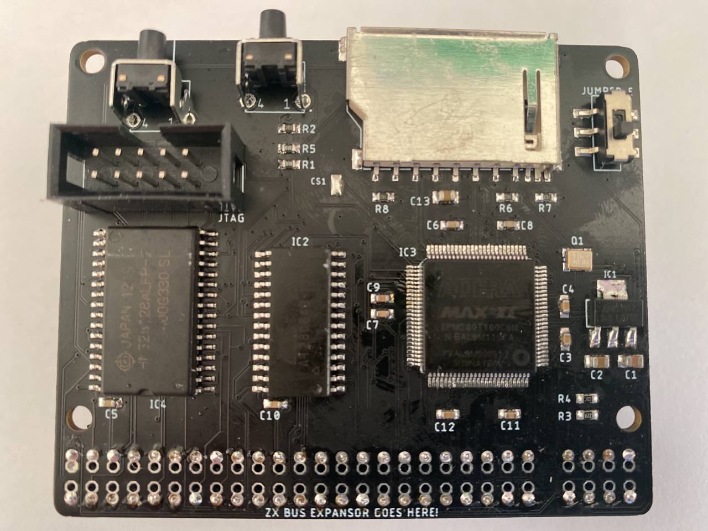
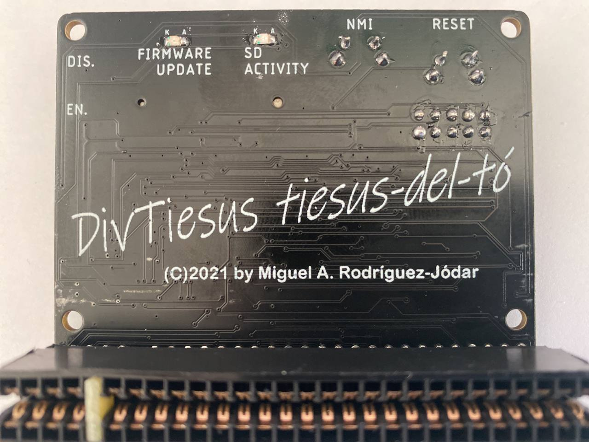
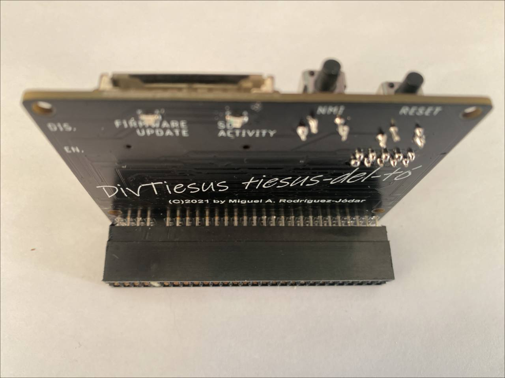

# Schematic, board and layout (top and flipped bottom side)
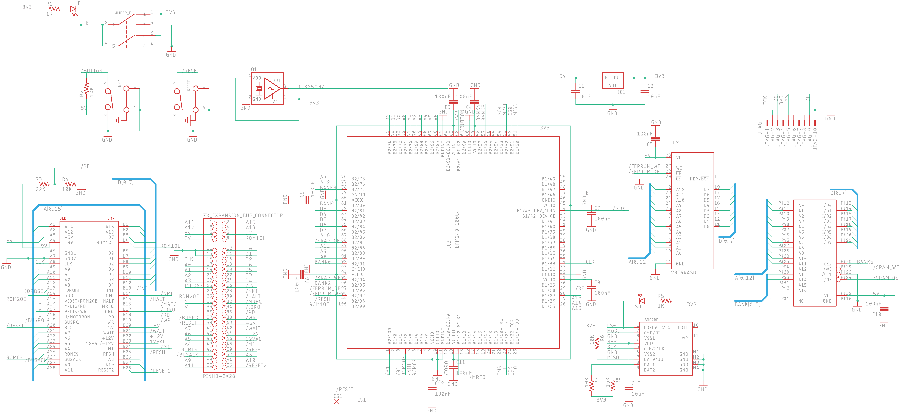
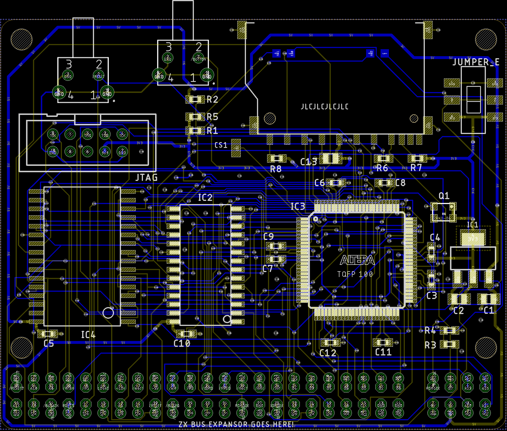
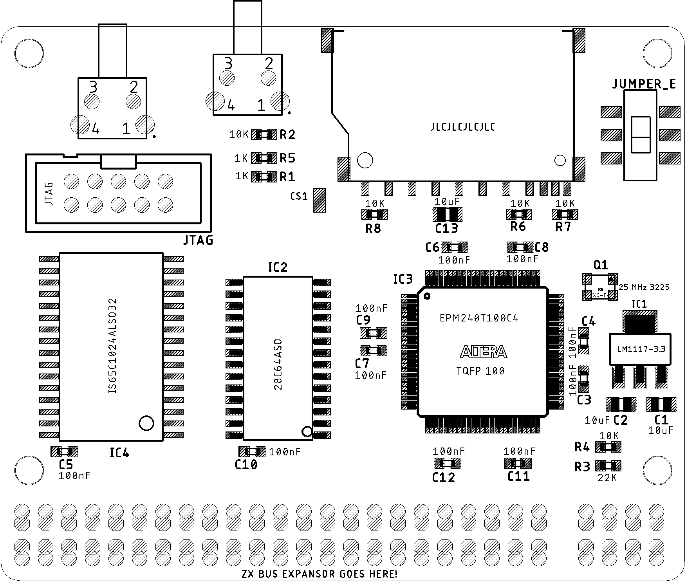
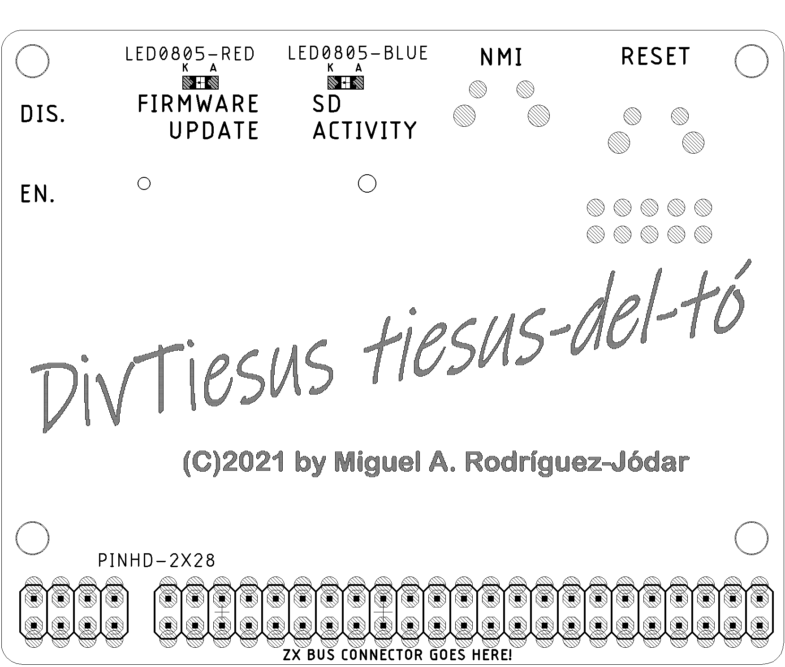

# Build
- First, you need the DivTIESUS PCB. You can order it from JLCPCB using the files in "gerber" directory. They are already tailored for JLCPCB PCB process.
- Second: get the component list. Following is the BOM, with Mouser references to get parts from them, but most of the components are rather standard so you can get it from severla other distributors. Many of them can also be obtained from Aliexpress.

## Bill of materials
|Qty|Value|PCB part|Mouser ref.|
| ------------ | ------------ | ------------ | ------------ |
|2|WS-TATU-TH 431256058726|NMI, RESET|710-431256058726|
|1|SDCARD SLOT|SDCARD|523-GMC020080HR|
|2|1K|R1, R5|603-RC0603FR-131KL|
|5|10K|R2, R4, R6, R7, R8|603-RC0603FR-1310KL|
|3|10uF|C1, C2, C13|581-0805YC106KAT2A|
|1|22K|R3|603-RC0603FR-1322KL|
|1|25 MHz 3225|Q1|520-3225Q-33-240-BST|
|1|28C64ASO|IC2|556-AT28C64B15SU|
|10|100nF|C3, C4, C5, C6, C7, C8, C9, C10, C11, C12|581-0603YC104J4T4A|
|1|CONECTOR_BUS_TRASERO|U$1|571-5530843-6|
|1|EPM240T100C4|IC3|989-EPM240T100C4|
|1|IS65C1024ALSO32|IC4|727-CY62128ELL45SXIT|
|1|JTAG|JTAG|517-N2510-6002RB|
|1|LED0805-BLUE|SD ACTIVITY|710-150080BS75000|
|1|LED0805-RED|FIRMWARE UPDATE ENABLED|710-150080RS75000|
|1|LM1117-3.3|IC1|579-TC1264-3.3VDB|
|1|SWITCH_SMD_6PIN|JUMPER_E|4000030382277 (Aliexpress)|

- The oscillator does not need to be 25 MHz. It can be about any value between 14 and 30 MHz (it may even work with values outside these limits -not tested-)
- It is very advisable to use a stencil and solder paste for the soldering process. You don't really need a reflow oven, as parts can be soldered using hot air. There are plenty of Youtube videos covering the matter.
- Start placing passives (resistors, capacitors, going from right to left. Leave the SRAM, EEPROM, SD socket and CPLD for the end (in this order). Don't place thru-hole components yet.
- Reflow the top side using an oven, hot plate or hot air. For two pad parts you can even apply the solder tip a few seconds on each pad to allow reflowing it, while keeping the part in place with a pair of tweezers. Same method can be used with SOT-223 parts (the 3.3V regulator), the SD card slot and the SMD switch.
- Turn the board and put-place-solder the two leds. Be aware of polarity with them. Also be aware that these components are very delicate and won't hold much heat, so try to not to apply too much heat and for too much time. You can see in the PCB that (K)athode and (A)node are marked. If you don't like red and blue, use whichever colours you like (or have available).

## First electrical testing
- Check that there is no shortcircuits at the 5V and 3.3V power rails.
- Check that there is no shorts between adjacent pads at the CPLD chip. You may need a magnifying glass to do that. Shorts between adjacent pins at the SRAM or CPLD are easier to notice (I hope).
- To fix any shorts, paste flux is your very best friend. Use it wisely. To me, AMTECH NC-559 solder flux is the best thing to have around (be aware of imitations in Aliexpress!)

After all this first checks, proceed to build and solder the ZX Spectrum bus connector:

## ZX Spectrum bus connector
- Take the 2x28 pin edge connector and cut about 1-2mm on each side to leave the ends opened, as in the last picture of this section.
- With a pair of tweezers, pull and extract the two metal contacts that are positioned at 5th place, where the index tab will be.
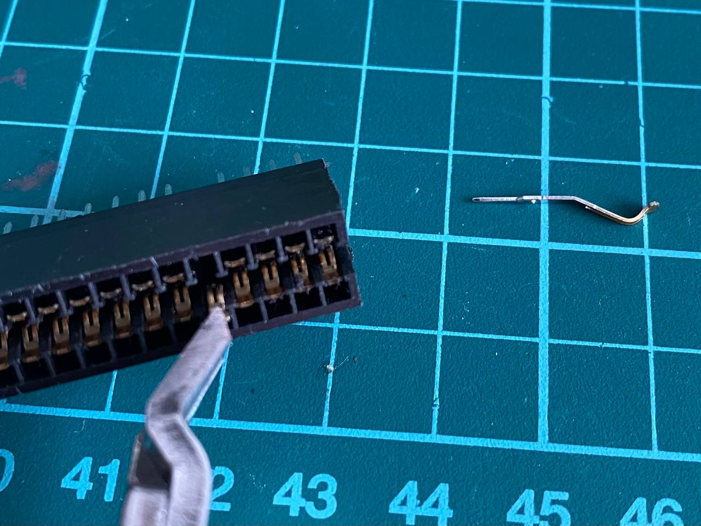
- Now take a small piece you can get from a PCB, 1.5mm thick and 7mm tall. This will be the index tab.
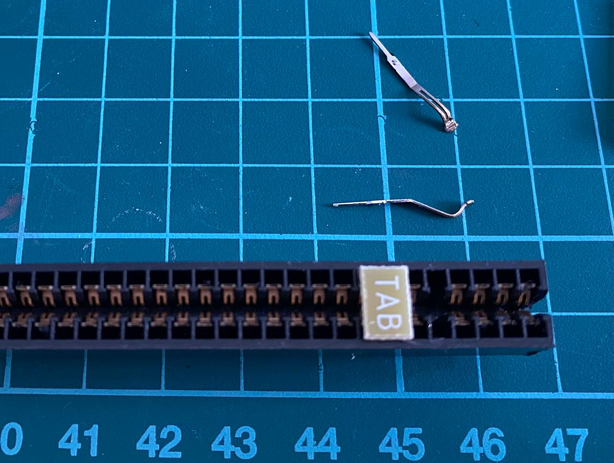
- Place the piece in the index hole. Sand it if it's too tall for the hole.
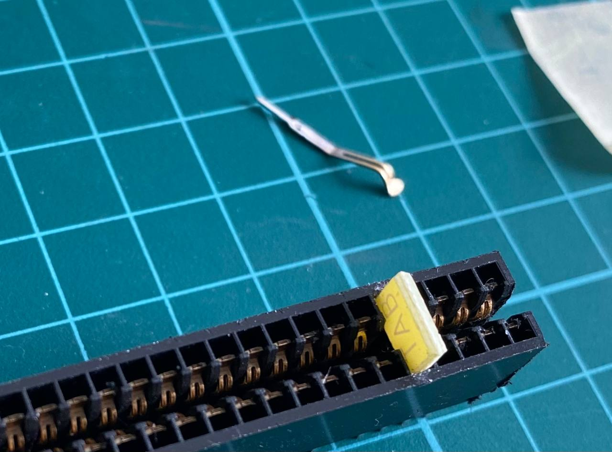
- Using a pair of pliers, push it in place. If it's too small for the hole, use some glue to keep it from coming loose.
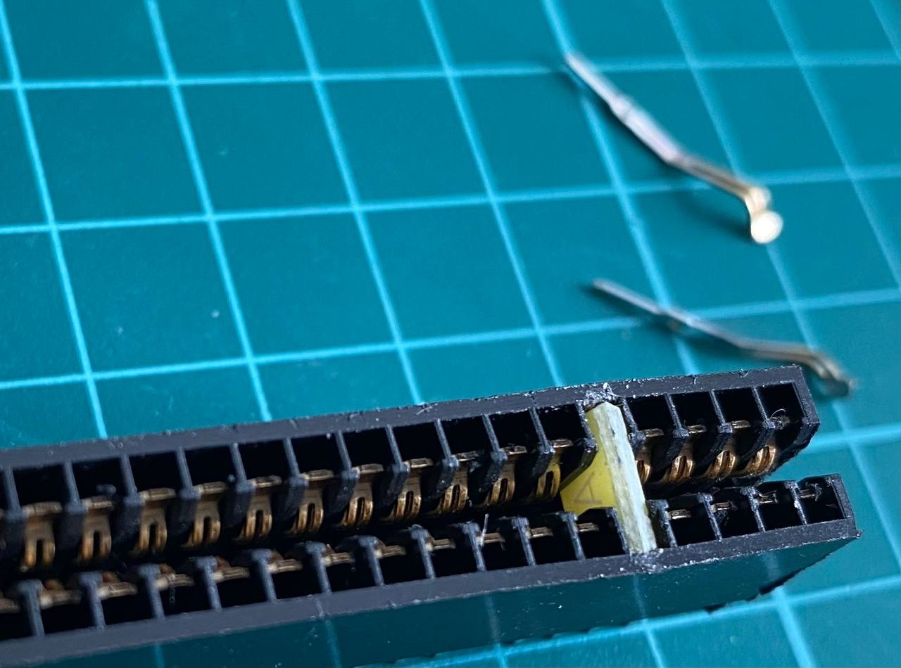
Now the edge connector is ready to work as a ZX Spectrum rear bus connector!                                                      
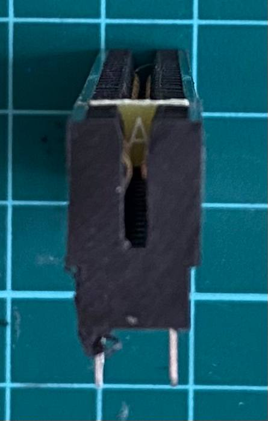

# FAQ (in progress)
***Is this the same version as you have already on sale?***
Almost! This version is the basic version, which is also the cheapest one I've made. Although it's the "basic" version, it has plenty of features, not present in any other DivMMC-like interface, atm.

***Can I take this, build or have someone else build some units, sell them and make some profit?***
I'm ok with that. I only ask you two things: do not remove my copyright noptice from the silk screen and any other document present in this repository, and if you make changes, additions, or otherwise improve the board, make those changes public and available for others as well.

***Can I adapt the Verilog code for a Xilinx part, like XC95144XL?***
Yes, but take into account that XC95 CPLDs doesn't have programmmable pull-ups, so you might need to add some 10K resistors to the board.

***Can I use 512K SRAM chips instead of 128K? Will the board recognize and use it at full capacity?***
Yes to both questions.

***I can see a "divmmc_mcleod_nom1.v" file with a version of the DivMMC module that isn't being used. What is that for?***
Glad you asked! It's an experimental DivMMC module that **DOESN'T NEED THE M1 SIGNAL FROM THE Z80**. It's experimental in the way that it works most of the time, but sometimes, not. If you program the CPLD with this version, it will use the RFSH signal instead of M1 to map and unmap the EEPROM, and a slighly sofisticated method to find out if it is in a M1 cycle, or memory read cycle, to inmediately map the EEPROM for TRDOS traps. More on this later.

***What "tiesus-del-tó" means?***
It means "really really broke".
